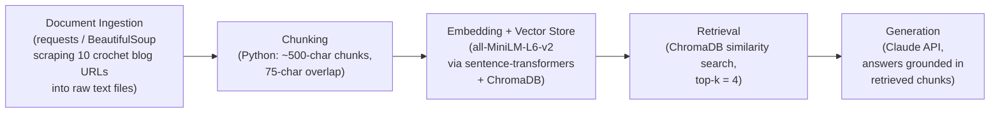

# Project 1 Planning: The Unofficial Guide

> Write this document before you write any pipeline code.
> Your spec and architecture diagram are what you'll use to direct AI tools (Claude, Copilot, etc.) to generate your implementation — the more specific they are, the more useful the generated code will be.
> Update the Retrieval Approach and Chunking Strategy sections if you change your approach during implementation.
> Update this file before starting any stretch features.

---

## Domain

### Crochet Stitches

For any given stitch (shell, bobble, basket weave, etc.), dozens of independent bloggers publish their own tutorial, each with slightly different wording, abbreviations (US vs. UK terms), stitch counts, and tips for fixing common mistakes. There's no single official reference that consolidates this — the official pattern-writing bodies (like the CGOA) define abbreviations but don't cover technique nuance, troubleshooting, or stitch variations. A beginner searching "how to do a bobble stitch" has to open 5-10 tabs, compare instructions, and reconcile conflicting terminology on their own. This knowledge is valuable because it's scattered across independent hobbyist blogs with inconsistent SEO quality, no cross-referencing, and no easy way to compare "which stitch works for X" across sources. A RAG system can pull together the specific tip or variation a crocheter needs without them having to manually search and compare multiple tutorial sites.

---

## Documents

<!-- List your specific sources: URLs, subreddit names, forum threads, or file descriptions.
     Aim for at least 10 sources that together cover different subtopics or perspectives within your domain. -->

| # | Source | Description | URL or location |
| - | ------ | ----------- | --------------- |
| 1 | The Spruce Crafts | How to Crochet Shell Stitch | [https://www.thesprucecrafts.com/how-to-crochet-a-shell-stitch-979096](https://www.thesprucecrafts.com/how-to-crochet-a-shell-stitch-979096) |
| 2 | Heart. Hook. Home. | Argyle Shell Crochet Stitch Tutorial | [https://hearthookhome.com/argyle-shell-crochet-stitch-tutorial/](https://hearthookhome.com/argyle-shell-crochet-stitch-tutorial/) |
| 3 | Amanda Crochets: Handmade with Love | How to Make the Basket Weave Stitch | [https://www.amandacrochets.com/how-to-make-the-basket-weave-stitch/](https://www.amandacrochets.com/how-to-make-the-basket-weave-stitch/) |
| 4 | Hookfully: Happy Crochet Family | Bobble Stitch Tutorial | [https://hookfully.com/bobble-stitch-tutorial/](https://hookfully.com/bobble-stitch-tutorial/) |
| 5 | Handmade by Stacy J | Blackberry Salad Crochet Stitch | [https://handmadebystacyj.com/2020/03/14/blackberry-salad-crochet-tutorial/](https://handmadebystacyj.com/2020/03/14/blackberry-salad-crochet-tutorial/) |
| 6 | Creations by Courtney | Crochet Heart: Stitch Tutorial | [https://creationsbycourtney.com/crochet-heart-stitch-tutorial/](https://creationsbycourtney.com/crochet-heart-stitch-tutorial/) |
| 7 | Selina Veronique: Crochet-DIY-Lifestyle | Crochet Lacy Shell Stitch Free Pattern | [https://www.selinaveronique.com/crochet-lacy-shell-stitch-free-pattern](https://www.selinaveronique.com/crochet-lacy-shell-stitch-free-pattern) |
| 8 | Stardust Crochet: Inspire, Learn, Create | How to Crochet: Coral Mesh; Crochet Video Tutorial for Beginners; Stitch Explorer Series | [https://stardustgoldcrochet.com/how-to-crochet-coral-mesh-crochet-video-tutorial-for-beginners-stitch-explorer-series/](https://stardustgoldcrochet.com/how-to-crochet-coral-mesh-crochet-video-tutorial-for-beginners-stitch-explorer-series/) |
| 9 | Stardust Crochet: Inspire, Learn, Create | How to Crochet: Bead Stitch; Video Tutorial for Beginners; Stitch Explorer Series | [https://stardustgoldcrochet.com/how-to-crochet-bead-stitch-video-tutorial-for-beginners-stitch-explorer-series/](https://stardustgoldcrochet.com/how-to-crochet-bead-stitch-video-tutorial-for-beginners-stitch-explorer-series/) |
| 10 | Rich Textures Crochet | Mesh Cluster Stitch; How to Crochet | [https://richtexturescrochet.com/mesh-cluster-stitch/](https://richtexturescrochet.com/mesh-cluster-stitch/) |

---

## Chunking Strategy

<!-- How will you split documents into chunks?
     State your chunk size (in tokens or characters), overlap size, and explain why those
     numbers fit the structure of your documents.
     A review-heavy corpus warrants different chunking than a long FAQ. -->

**Chunk size:** ~500 characters (roughly 100-125 tokens)

**Overlap:** 75 characters

**Reasoning:** My documents are blog-style tutorials, not short reviews — each page mixes an intro/backstory, a materials list, a numbered step-by-step instruction sequence, and troubleshooting tips. These sections are long enough that a single stitch tutorial can run 1,500-3,000+ characters, so a small chunk size (like 200 characters used for one-line reviews) would cut a single instructional step in half and make it unretrievable on its own. At the same time, chunks that are too large (e.g., a whole article as one chunk) would bury a specific fact (like "chain 3 counts as your first double crochet") inside a mass of unrelated prose, diluting the embedding and hurting retrieval precision. 500 characters keeps each chunk to roughly one instructional step or one tip, which matches how these tutorials are structured. The 75-character overlap protects against a step's setup ("insert hook into the next stitch, yarn over,") being separated from its conclusion ("...pull through and complete as normal") by a chunk boundary — with overlap, at least one of the two adjacent chunks will contain the full instruction. If retrieval starts returning chunks that only have half of a stitch instruction, that's a sign chunks are too small or overlap is too thin; if retrieval returns chunks that mix multiple unrelated stitches or steps, that's a sign chunks are too large.

---

## Retrieval Approach

<!-- Which embedding model are you using (e.g., all-MiniLM-L6-v2 via sentence-transformers)?
     How many chunks will you retrieve per query (top-k)?
     If you were deploying this for real users and cost wasn't a constraint, what tradeoffs
     would you weigh in choosing a different embedding model — context length, multilingual
     support, accuracy on domain-specific text, latency? -->

**Embedding model:** all-MiniLM-L6-v2 (via sentence-transformers) — small, fast, runs locally with no API cost, and performs well on general English text like these tutorials.

**Top-k:** 4 chunks per query. This is enough to give the LLM a full instructional step plus a bit of surrounding context (like a troubleshooting tip or the previous step) without flooding the prompt with unrelated stitches. Too few (top-k=1) risks missing the relevant chunk if the exact instruction is split across two chunks; too many (top-k=10+) risks pulling in chunks about a different, tangentially related stitch and confusing the generated answer with irrelevant details.

Semantic search finds relevant chunks even without exact keyword overlap because embedding models map text into a vector space based on meaning, not literal word matches — so a query like "how do I make my crochet bumpy" can retrieve a chunk about the "bobble stitch" or "popcorn stitch" even though neither the word "bumpy" appears in the tutorial, because the model has learned that these concepts are semantically related from its training data.

**Production tradeoff reflection:** If cost weren't a constraint, I'd consider a larger, higher-accuracy embedding model like OpenAI's text-embedding-3-large or Cohere's embed-v3, which tend to perform better on nuanced domain-specific phrasing (e.g., distinguishing "front post double crochet" from "back post double crochet"). I'd weigh: (1) context length — my chunks are short so this matters less here, but longer documents would need it; (2) multilingual support — valuable if I wanted to include crochet tutorials in Spanish or other languages, since crochet terminology often differs meaningfully by region (US vs. UK stitch names); (3) accuracy on domain-specific text — a model with better recall on niche crafting vocabulary would reduce the risk of confusing similar-sounding stitches; (4) latency — a larger model adds retrieval latency, which matters more for a live user-facing chat interface than for batch processing. For a real product I'd likely benchmark a few options against my own eval questions rather than assume bigger is better.

---

## Evaluation Plan

<!-- List your 5 test questions with their expected correct answers.
     Questions should be specific enough that you can judge whether the system's response
     is right or wrong. "What are good dining halls?" is too vague.
     "What do students say about wait times at [dining hall name] during lunch?" is testable. -->

| # | Question | Expected answer |
|---|----------|-----------------|
| 1 | According to Amanda Crochets, what foundation chain length is required for the basket weave stitch? | A multiple of 6 stitches plus 4 more (chain length = 6n + 4, e.g. 10, 16, 22, 28...). |
| 2 | According to Hookfully's tutorial, how many incomplete stitches are worked into the same stitch to make one bobble, and how many loops are pulled through at the end? | 5 incomplete stitches are worked into the same stitch (yarn over, insert hook, pull up a loop, yarn over, pull through 2 loops — repeated 5 times), then yarn over and pull through all 6 loops on the hook. |
| 3 | According to Creations by Courtney, what two stitch types form the foundation row of the crochet heart pattern, and what stitches make up the heart motif itself? | The foundation row uses treble crochet and chain stitches; the heart motif itself is worked using treble, double crochet, and single crochet stitches plus a picot detail at the center point. |
| 4 | According to Stardust Crochet, what three techniques combine to make the coral mesh stitch? | A modified Solomon's knot (pulling up a long loop, yarn over, pull through, chain 1), half double crochet, and chain stitches. |
| 5 | What is the "modified Solomon's knot" loop length recommended in Stardust Crochet's coral mesh tutorial? | A loop of 1/2" to 3/4" is pulled up before working the yarn over and chain 1. |

---

## Anticipated Challenges

<!-- What could go wrong? Name at least two specific risks with reasoning.
     Consider: noisy or inconsistent documents, missing source attribution, off-topic
     retrieval, chunks that split key information across boundaries. -->

1. **Inconsistent terminology across sources.** Different bloggers use different abbreviations and, sometimes, US vs. UK stitch terms (e.g., "double crochet" means different physical stitches in US vs. UK patterns). A query about "double crochet" could retrieve chunks that assume different conventions, causing the generated answer to mix instructions from incompatible stitch systems. I'll mitigate this by noting each source's terminology convention (if stated) and, if time allows, adding a note in the system prompt reminding the LLM to stick to one source's convention per answer.

2. **Chunks that split a step's setup from its completion.** Several tutorials write multi-clause instructions across sentences (e.g., "yarn over, insert hook..." followed a sentence later by "...pull through and complete the stitch"). If a chunk boundary falls in the middle, retrieval could surface only half of a stitch instruction, leading the LLM to generate an incomplete or incorrect answer. My 75-character overlap is meant to reduce this risk, but it's not guaranteed to fully solve it for longer multi-sentence steps — I'll spot-check chunks near known long instructions during testing.

3. **Off-topic retrieval due to visually blocked or JavaScript-heavy pages.** Some crochet blogs (e.g., Persia Lou) return 403s or heavily obfuscate content behind ads/scripts when scraped programmatically, which could mean some sources are thin or missing from the corpus, causing certain stitches to have weak or no retrievable content and forcing the LLM to answer from general knowledge instead of the actual source material.

---

## Architecture

<!-- Draw a diagram of your pipeline showing the five stages:
     Document Ingestion → Chunking → Embedding + Vector Store → Retrieval → Generation
     Label each stage with the tool or library you're using.
     You can use ASCII art, a Mermaid diagram, or embed a sketch as an image.
     You'll use this diagram as context when prompting AI tools to implement each stage. -->

---

## AI Tool Plan

<!-- For each part of the pipeline below, describe:
     - Which AI tool you plan to use (Claude, Copilot, ChatGPT, etc.)
     - What you'll give it as input (which sections of this planning.md, which requirements)
     - What you expect it to produce
     - How you'll verify the output matches your spec

     "I'll use AI to help me code" is not a plan.
     "I'll give Claude my Chunking Strategy section and ask it to implement chunk_text()
     with my specified chunk size and overlap" is a plan. -->

**Milestone 3 — Ingestion and chunking:** I'll give Claude the Documents table (the 10 source URLs) and the Chunking Strategy section (500-char chunks, 75-char overlap, and my reasoning about instructional steps) and ask it to write a `scrape_documents()` function that fetches/cleans each URL into plain text, plus a `chunk_text()` function implementing my exact chunk size and overlap. I'll verify by printing a sample of chunks from the basket weave and bobble stitch pages and manually checking that no chunk cuts a stitch instruction in a way that loses its meaning entirely.

**Milestone 4 — Embedding and retrieval:** I'll give Claude the Retrieval Approach section (all-MiniLM-L6-v2, top-k=4, using ChromaDB) and ask it to implement an `embed_and_store()` function that embeds each chunk and upserts it into a persistent ChromaDB collection, plus a `retrieve(query, k=4)` function that returns the top-k chunks with their source metadata. I'll verify by running 2-3 of my Evaluation Plan questions through `retrieve()` and manually checking that the returned chunks actually contain the expected answer content and correct source attribution.

**Milestone 5 — Generation and interface:** I'll give Claude the retrieved-chunk format from Milestone 4 and ask it to implement a `generate_answer(query)` function that constructs a prompt including the retrieved chunks (with source citations) and calls the Claude API to produce a grounded answer, plus a minimal CLI or simple web interface to ask questions interactively. I'll verify by running all 5 Evaluation Plan questions end-to-end and comparing the generated answers against my documented expected answers, checking both correctness and that sources are cited.
